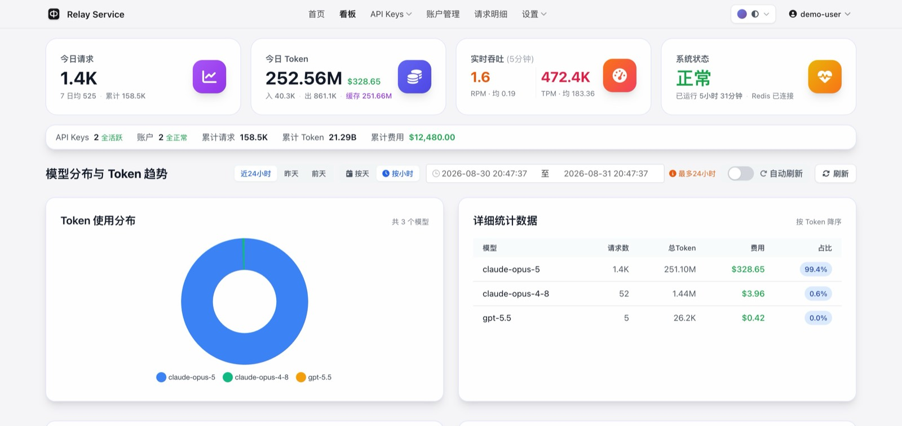
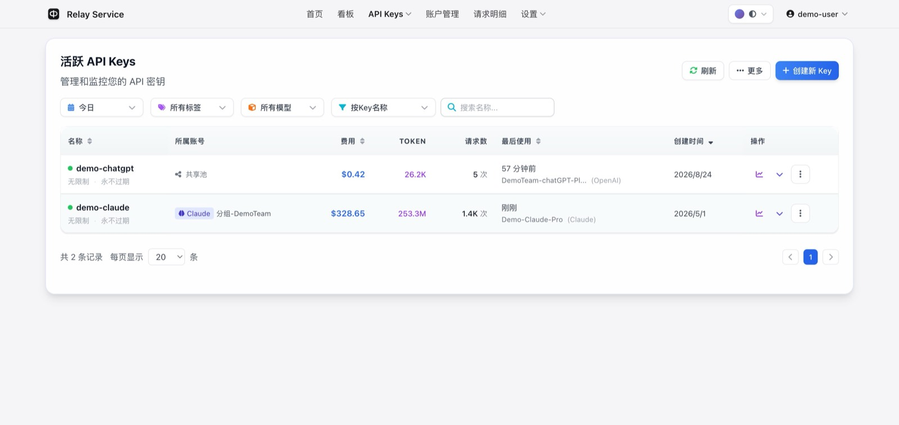
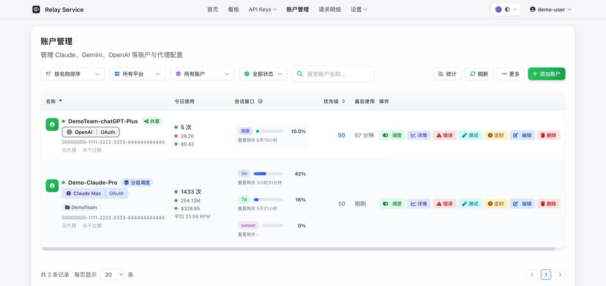

# Interface Preview / 界面预览

> All account names, usage and cost figures in these screenshots are demo data.
>
> 以下截图中的账号、用量与费用均为演示数据。

## Dashboard / 看板

Request volume, token usage, real-time throughput and model distribution at a glance.

请求量、Token 用量、实时吞吐与模型分布一屏掌握。

## API Keys

Per-key cost, usage and last-used time, all in one list.

每把 Key 的费用、用量与最后使用时间一目了然。

## Accounts / 账户管理

Multi-platform accounts, session windows and scheduling priority in one place.

多平台账户、会话窗口与调度优先级集中管理。

---

The same screenshots are shown in the "看看它长什么样" section on the landing page.

首页「看看它长什么样」一节展示的是同一组截图。
